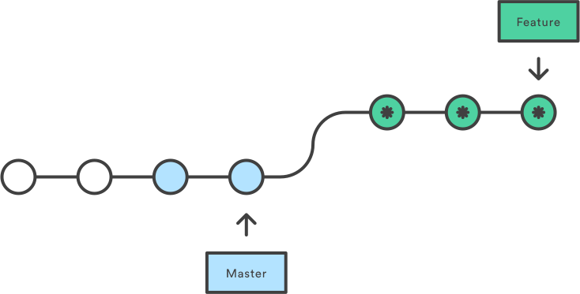

## Some things I'd like you to walk away with

- understand the difference between merging & rebasing
- not be afraid to rewrite history, and know when not to
- have some strategies for avoiding or resolving merge conflicts
- understand the 'Only the Gods' [git koan](http://stevelosh.com/blog/2013/04/git-koans/).


## It doesn't have to be this way!


## What is git?

- a collection of _changes_ organized into an _ordered list_
- a DAG of diffs!
- except for an initial commit, a commit has a pointer to a previous (parent) commit...
- ... and a list of changes from that parent commit


## Remember

- git is for _software development_; our process doesn't always match up neatly
- "feature": set of changes to make some improvement
- in a merge, "source branch" is where commits come _from_, "target branch" is where we want them to go
- e.g. `update-data-cleaning` -> `master`
- branches are _pointers_ to a commit; that's it


## Special Case: Merge Commits

- merge commits have _at least two_ parents
- created whenever a _non fast-forward_ merge is done
- default, simplest way to incorporate changes from one branch to another


## Why I hate merge commits

- useless reference to a second parent that we likely deleted (remove source branch)
- all history of source branch smashed into single, _unexplained_ commit
- history can get very messy!
- all these combine to make history-introspection difficult


## Alternative: Rebase!

- places the new commits in the source branch at the end of target branch
- because commits are _diffs_, these new commits are _different_ than on source branch
- results in perfectly linear history!
- at the command-line: `git merge <source> --ff-only` ("fast-forward merge")




## Downsides of rebasing

- requires a bit more understanding of git
- Github & Gitlab don't allow setting an org-wide default merge strategy
- get full, potentially messy history of source branch (more on this later)


## Side-by-side comparison


# Keeping History clean


## Don't be this guy


## Solution: Rewrite it!

- git history is not immutable, we can make it look however we like!
- `git commit --amend` & `git rebase -i`
- use caution; rewriting history underneath a coworker gives them right to hit you


## Amending a commit

- folds new changes into the last commit (avoid a silly new commit)
- `git commit --ammend`
- great for fixing little mistakes like typos
- if pre-amend commit was pushed up, force-push:
    - `git push --force`


## Interactive Rebasing

- rewrite history in all kinds of ways!
- `git rebase -i <target>`
    - this will _rebase_ (placing source commits at tip of target)
    - while also allowing you to make additional changes
- e.g. `git rebase -i master` or `git rebase -i HEAD~3`
    - (`HEAD` is a pointer to where you are right now, `~3` means "go back 3")


## What it looks like

`git rebase -i HEAD~4`

```
pick dbfd954 Initialize Rproj and packrat.
pick 1482212 Explore sample data
pick 1e650fb Update consulting agreement with different name for client officer.
pick 5a37eac Remove name for client signee by request.

# Rebase d263391..5a37eac onto d263391
#
# Commands:
#  p, pick = use commit
#  r, reword = use commit, but edit the commit message
#  e, edit = use commit, but stop for amending
#  s, squash = use commit, but meld into previous commit
#  f, fixup = like "squash", but discard this commit's log message
#  x, exec = run command (the rest of the line) using shell
#
# These lines can be re-ordered; they are executed from top to bottom.
#
# If you remove a line here THAT COMMIT WILL BE LOST.
#
# However, if you remove everything, the rebase will be aborted.
#
# Note that empty commits are commented out
```


## Suggestions to stay safe

- stick to `pick`, `reword`, `squash`, `fixup`
- occasionally a reorder or omission makes sense
- I've _never_ used `edit` or `exec`


## Working with rewritten history

- suppose you're reviewing an MR, so you pull the branch down locally
- what happens if they rewrite history, and you need to pull again?
- (this might be as innocent as rebasing on `master`)
- could delete & (re-)pull, or _fetch_ then _reset_:
    - `git fetch origin <source>` (doesn't alter local copy)
    - `git reset --hard FETCH_HEAD` or `git reset --hard <source>`


## Squashing

- when rebasing, we can _squash_ the target branch commits into _one_ new commit
- compresses possibly-dirty history into one commit
- Github lets you edit full message when doing this
- Gitlab uses MR title as first line, no body :(
- at the command-line: `git merge <source> --squash` (can combine with `--ff-only`)


## When to rewrite history

- only do it on branches others aren't working on
- never `master`! (well, almost never)
- unnecessary if the source branch will be squashed
- if doing on a WIP merge request, try to wait until the end


# When Merging Goes Wrong


## The dreaded _Merge Conflict_

- suppose you make a branch `feature` from `master`, and make a change to a file
- then someone else (or you!) makes a new commit on `master` changing _the same file_...
- how can git possibly know what to do here?
- you can either pick one version or the other, or create a new, different version


## BOOM


## Avoid when possible!

- merge conflicts suck; avoid them (easier said than done!)
- some suggestions:
    1. when work is being done on multiple branches (you know, _collaborating_...the whole point of git!),
        - try to ensure work is _orthogonal_; you're editing different files (or folders!)
    2. consider where you branch _from_ and merge _into_
        - they should almost always be the same!
    3. after a branch is merged you should _almost always_ delete it; new work goes on a new branch!
        - Gitlab/Github give nice boxes & buttons to do this at merge-time


## When you can't avoid it

- resolving conflicts looks a bit different between plaintext and binary files
    - with plaintext, you can combine changes; with binary, you have to pick A or B
- also different if you're merging via merge-commit or fast-forwarding (rebasing)
    - resolve conflict when _merging_ vs. when _rebasing_


## What it looks like

```
▶ git merge plaintext 
Auto-merging plain.txt
CONFLICT (content): Merge conflict in plain.txt
Automatic merge failed; fix conflicts and then commit the result.

▶ git status
On branch master
Your branch is up-to-date with 'origin/master'.

You have unmerged paths.
  (fix conflicts and run "git commit")

Unmerged paths:
  (use "git add <file>..." to mark resolution)

	both modified:      plain.txt

no changes added to commit (use "git add" and/or "git commit -a")
```

- be not afraid!


## Resolving a plaintext merge conflict

git edits the file to show both versions

```
<<<<<<< HEAD
My name is Rob. Rob the file.
=======
My name is Bob. Bob the file.
>>>>>>> plaintext
```

- first part is the current version
    - `HEAD` is the target, which we're on currently
- second part is the version we're trying to merge in
    - `plaintext` is the source branch
- this can happen multiple times throughout the doc!
    - git is pretty good about realizing which parts match, but it can get confused
- `git add` and `git commit` when you're done


## Resolving a binary merge conflict

- git defaults to the _current_ (target) version of the file
    - doesn't make this clear; _always_ double check!
- you can use `git checkout --theirs -- <file>` to get the target version
- and `git checkout --ours -- <file>` to get (back to) the current version
- as before, add and commit when done


## What about rebasing?

- merge conflicts can happen here too!
- resolution is similar, but the messages look a bit different (scarier tbh)
- after fixing things, you still add, but then do `git rebase --continue`
- multiple conflicts could potentially arise, and you'll go through them on-by-one, oldest to newest
- this might sounds like more work, but should usually be just the one phase of conflict


## What _that_ looks like

```
▶ git rebase master 
First, rewinding head to replay your work on top of it...
Applying: Change Rob to Bob in plaintext file.
Using index info to reconstruct a base tree...
M	plain.txt
Falling back to patching base and 3-way merge...
Auto-merging plain.txt
CONFLICT (content): Merge conflict in plain.txt
Failed to merge in the changes.
Patch failed at 0001 Change Rob to Bob in plaintext file.
The copy of the patch that failed is found in:
   /home/claytonjy/gitlab/git-sandbox/.git/rebase-apply/patch

When you have resolved this problem, run "git rebase --continue".
If you prefer to skip this patch, run "git rebase --skip" instead.
To check out the original branch and stop rebasing, run "git rebase --abort".
```

- be not afraid of this one, either!


# Demo time!


## Parting Lessons

- mind your branches!
- rewrite _your_ history, not _shared_ history
- merge commits kill babies


## References & Acknowledgements

[This guide from Atlassian](https://www.atlassian.com/git/tutorials) is really excellent, several images came from there (which I cropped) but I find myself back there a lot for all sorts of git stuff, from simple to advanced.

The merge vs. rebase image came from [Willam Durand](http://slides.williamdurand.fr/git-and-github-and-open-source), who references a dead link at [The Dream of Super Surplus Power](https://surpreem.com).

The merge-conflict image came from another Atlassian site, a post on the [Atlassian Developers blog](https://developer.atlassian.com/blog/2015/01/a-better-pull-request/).

The fun comics came from the always-relevant [XKCD](https://xkcd.com).

# Questions?
